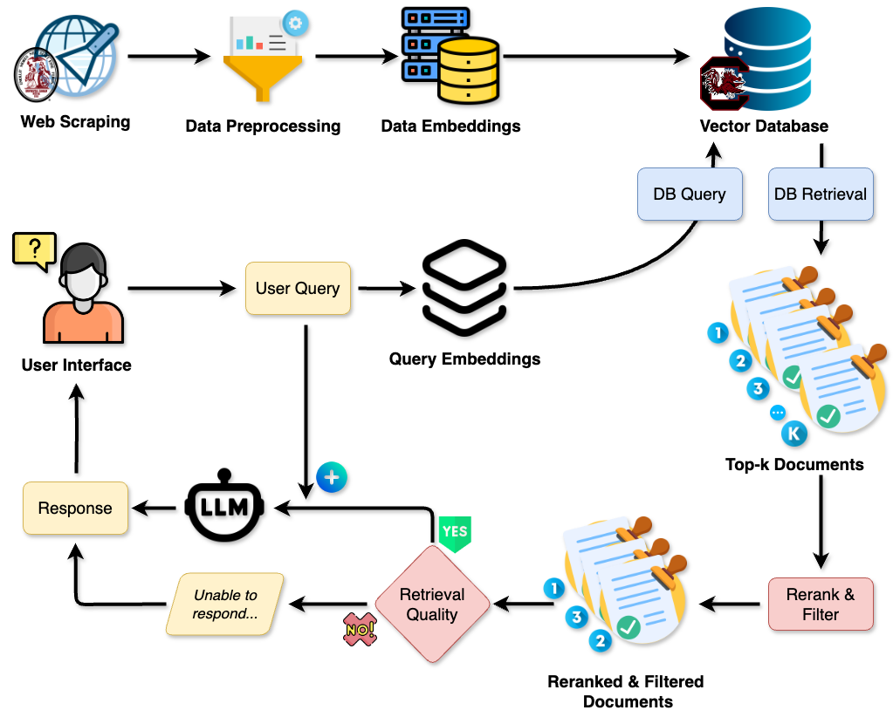
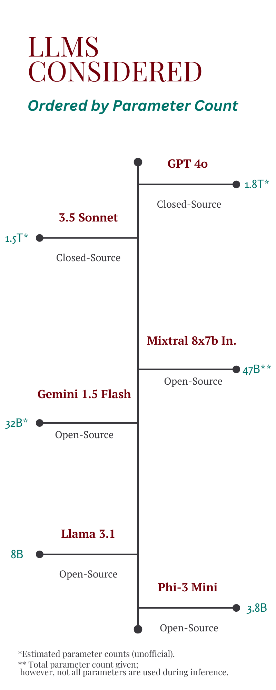

# RoostAI: A University-Centered Chatbot

## Introduction
In today's academic environment, students, staff, and visitors alike rely on digital tools to quickly access relevant information about the university they are part of. At the University of South Carolina (USC), despite the abundance of online resources, there is no unified, interactive platform that enables seamless access to vital information specific to the campus. Existing resources are often dispersed across various websites and portals, making it difficult for users to quickly find accurate and up-to-date answers.

This project seeks to address that gap by developing a Retrieval-Augmented Generation (RAG) based chatbot tailored for the USC community. The chatbot will serve as an intelligent virtual assistant, allowing users to ask natural language questions and receive precise, factual responses drawn from a USC-specific knowledge base. Leveraging advanced web-scraping, natural language processing (NLP), and machine learning techniques, the system will collect, index, and retrieve information from relevant USC web domains and other local resources. Our goal is to create a user-friendly, efficient, and highly accurate platform to enhance the overall campus experience.

## Problem Information
As previously mentioned, USC lacks a comprehensive and easy-to-use resource that informs students of campus-related information such as course offerings, scheduled events, or other general information. A lot of this information is gained through personal experience or with 1-1 interaction with another person. An automated conversational agent with access to useful information would allow for a much easier and faster user experience.

At the core of a RAG-based chatbot system is an indexed database that allows for the retrieval of relevant documents to the user query. As such, our indexed database will have to contain relevant information to the University of South Carolina. Our dataset will primarily include all USC web domain data (web addresses ending in [sc.edu](http://sc.edu) or similar). We will include useful government and tourist/travel web addresses to supplement useful information regarding Columbia and South Carolina. We plan to develop a custom web-scraping tool using a BFS/DFS-based travel approach to extract the necessary text/images/files from these web addresses to develop our dataset. The information will be indexed and stored in a vector database to facilitate easy access and fast retrieval. Details about the indexing and storing processes are in the Technical Approach section.

The resulting chatbot should be able to answer relevant queries conversationally, providing the user with factual information in a more interactive manner. It should ideally serve as a resource for transfer/incoming students to become acquainted with the University and its processes smoothly and quickly. 

The most intuitive way to evaluate our resulting system would be to have a user study prompting users to compare and contrast the usability of the system against other competing resources over sample queries. Other methods include numerically evaluating end-end metrics like latency or NLP-focused metrics, which are explained more in detail in our Evaluation section

## Technical Approach
Our project will implement a chatbot based on the Retrieval-Augmented Generation (RAG) framework, utilizing large language models (LLMs) alongside a USC-specific vector database to provide quick and accurate information retrieval. The approach, Figure 1, consists of two main components: data acquisition and the user-chat interface, with an additional focus on cloud deployment for scalability and accessibility.

|                                                                                                                                                                                                                                                                                                     | 
|:------------------------------------------------------------------------------------------------------------------------------------------------------------------------------------------------------------------------------------------------------------------------------------------------------------------------------------------------:| 
| *Figure 1. The RoostAI Workflow Diagram. Data is scraped, preprocessed, and embedded into a vector database. User queries are converted into embeddings to retrieve top-k documents, which are reranked and filtered. If retrieval quality is high, the LLM generates a response; otherwise, the system returns an "unable to respond" message.* |

### Data Acquisition and Processing

The data acquisition phase begins with web scraping relevant USC resources. We will focus on extracting data from all USC-affiliated web domains and supplement it with relevant government, travel, and tourism websites to provide a broader context about Columbia and South Carolina. This data will include text, images, and other files necessary for an enriched information repository.

Once collected, the raw data will undergo a pre-processing pipeline designed to enhance the information's suitability for retrieval. This pipeline will include techniques such as:

- **Text normalization**: Tokenization, stemming, and stop-word removal to standardize data.
- **Segmentation**: Dividing documents into sentences or paragraphs to allow more focused and efficient searches.
- **Metadata tagging**: Adding useful tags such as authenticity scores, content summaries, and source information, enabling more refined searches and filtering.

The processed data will then be converted into vector representations using embedding techniques to capture the semantic essence of the content. These vectors will be indexed into a vector database, which supports rapid and accurate retrieval, regardless of database size. This indexing process will be continuously updated to ensure the system remains current with new content as it is published.

### User-Chat Interface

The user-chat interface is designed to offer a smooth and intuitive interaction experience. When a user submits a natural language query, the system converts it into an embedding that will be used to search the vector database for relevant information. We will leverage pre-trained models like BERT to ensure that the retrieval process captures not only keyword matches but also the semantic meaning of the user’s query.

The system retrieves the top-k most relevant documents, which are then subjected to a reranking and filtering phase. Reranking is done using predefined relevance metrics and scoring algorithms to ensure the most accurate answers rise to the top. Documents that do not meet a certain quality threshold will be excluded to maintain a high level of response accuracy. If none of the documents are relevant, the system will issue a “do not answer” response rather than providing incomplete or inaccurate information. Otherwise, the most relevant documents will be appended to the user query and passed to the LLM for final answer generation.

### Cloud Hosting and User Interface Development

To ensure scalability and accessibility, the entire system will be hosted on a cloud-based platform, such as Chameleon Cloud. Cloud hosting provides the flexibility to scale the system as our testing progresses.

The chatbot will be made accessible through a user-friendly web interface, allowing students, staff, and visitors to interact with it via desktop and mobile browsers. The user interface (UI) will be designed with simplicity and ease of use in mind, featuring a clean and minimalistic layout where users can enter queries, view responses, and access additional information as needed. The chatbot will be hosted on the cloud which ensures ensures high availability and uptime for users on and off campus. By deploying the vector database and LLM services in a cloud environment, we will also be able to easily integrate load-balancing and backup solutions to maintain optimal performance. We will also explore the possibility of integrating the chatbot into existing USC platforms, such as mobile apps and the university’s official website, to further enhance accessibility.

## Evaluation
First and foremost, we will utilize metrics like latency, CPU usage, and other physically measurable metrics to numerically evaluate our overall system. Aside from these, we will also individually evaluate both the LLM and RAG components.

### LLM Selection Evaluation

Our first system-related evaluation will entail choosing the specific LLM that will be used to generate our system response for the user. We would like our system to not only be efficient and provide responses with low latency but also provide human-readable and relevant responses. For this reason, we would like to select an LLM that does reasonably well in different metrics such as latency, BLEU, ROUGE, and Perplexity. We will do this by testing LLMs ranging from different sizes and both open and closed models (Figure 2).

### RAG System Evaluation

We will also evaluate the effectiveness of our data retrieval using a few different metrics. Some of the metrics that we plan to use to evaluate the RAG-component of our system include Mean Reciprocal Rank (MRR), Precision@k, and Recall@k. We will use these to gain a sense of which components allow for the most effective retrieval of our data.

### USC FAQ Validation

Another method we plan to use to evaluate our system includes evaluating the system’s performance on answering frequently asked questions (FAQs) which are generally answered in worksheets at New Student Orientation and similar events. We would pass the questions as queries to the systems, and evaluate the system responses with the provided answers. We would calculate and present semantic similarity as an indicator to see if the system provided a relevant response to the query.

### User Study

Time permitting, we plan to host our system using Chameleon Cloud and create a full pipeline consisting of a database, backend, and frontend. As a result, we would be able to provide access to our system to users in the form of a user study. We plan to present users with a few different tasks and ask them to carry them out using our system, an LLM like ChatGPT, and a traditional Google search and rate different aspects of the results. This would concretely convey the usability of our system over traditional existing approaches.

|                                                                                                                                                                            | 
|:----------------------------------------------------------------------------------------------------------------------------------------------------------------------------------------------------------------------------------------:| 
| *Figure 2. LLMs chosen for evaluating RoostAI. In increasing order of parameter count, they are Phi-3 mini (open),  Llama 3.1 (open), Gemini 1.5 Flash (open), Mixtral 8x7b In.(open), Claude 3.5 Sonnet (closed), and GPT-4o (closed).* |

## Related Work
Recent advancements in Retrieval-Augmented Generation (RAG) systems have demonstrated the power of combining retrieval models with large language models (LLMs) to provide accurate, context-aware answers. Huang et al. (2024) offer a comprehensive survey of RAG frameworks, detailing various techniques for retrieval and generation, which serve as the foundation for our approach. Xie et al (2024) provide a comprehensive overview of a RAG-based system that incorporates real-time data using a web search API and withstanding unchanging fact data using knowledge graph integration.

While many RAG systems have been applied to open-domain tasks like customer service and question-answering, few have focused on university-specific use cases. Current chatbots deployed by universities, such as rule-based systems, often lack the flexibility and depth of understanding required for complex, context-sensitive queries. Our project seeks to address this gap by developing a USC-specific RAG-based chatbot that provides accurate, up-to-date campus information through an efficient retrieval process.

Unlike existing systems that rely on general-purpose datasets, our chatbot will use a custom web-scraped dataset from USC domains, allowing it to offer highly relevant responses tailored to the needs of students, staff, and visitors. This hyper-localized focus distinguishes our approach from other applications of RAG.

## References
Huang, Y., & Huang, J. (2024). A Survey on Retrieval-Augmented Text Generation for Large Language Models. arXiv preprint arXiv:2404.10981.

Xie, W., Liang, X., Liu, Y., Ni, K., Cheng, H., & Hu, Z. (2024). WeKnow-RAG: An Adaptive Approach for Retrieval-Augmented Generation Integrating Web Search and Knowledge Graphs. arXiv preprint arXiv:2408.07611.